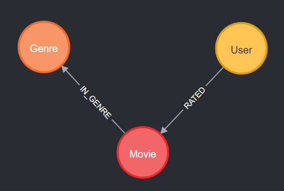

# Lab 4: Recommendation Engines


## Introduction

Your goal of this Lab is building a movie recommendation engine. In our classes, we studied two types of filtering used for such engines -  one is the content-based filtering, and the second is called collaborative filtering. You will build variations of two engine types using the data on users and movies they watched.  You may fin the material from Week 06 useful. 

This Lab consists of two sections. The first section is concerned with the content-based recommendations, and the second section is the direct application of collaborative filtering techniques. The second section will be our focus for the next week's lab.


## Setup


1. Create a new Neo4j DBMS or use an existing one and create a new database. 
1. Make sure both *APOC* and *GDS* libraries are available in this DBMS.
2. Import the user-movie-genre data set by running the following statements in Neo4j Browser. 
    - This code is saved in the file `import-data.cypher`. 
    - Examine the code to better understand the nodes and their properties

```sql 
// Create necessary indices to speed up the load
CREATE INDEX movie_title_idx IF NOT EXISTS FOR (n:Movie) ON (n.title);
CREATE INDEX movie_movie_id_idx IF NOT EXISTS FOR (n:Movie) ON (n.movieId);
CREATE INDEX movie_imdb_id_idx IF NOT EXISTS FOR (n:Movie) ON (n.imdbId);
CREATE INDEX genre_name_idx IF NOT EXISTS FOR (n:Genre) ON (n.name);
CREATE INDEX user_name_idx  IF NOT EXISTS FOR (n:User) ON (n.name);

// Import genres and movies. Movies properties are stored in Genres file
WITH 'https://raw.githubusercontent.com/vryzhov/COSC416-2024/main/lab4/' AS base
  WITH base + "movies-genre.csv" AS uri
LOAD CSV WITH HEADERS FROM uri AS row
MERGE (g:Genre{name:row.genre})
MERGE (m:Movie{movieId:toInteger(row.movieId)})
  SET m += {budget: toInteger(row.budget), imdbRating: toFloat(row.imdbRating),
      title:row.title, runtime: toFloat(row.runtime), 
      revenue: toInteger(row.revenue), imdbId: row.imdbId
  }
MERGE (m) -[r:IN_GENRE] ->(g)
RETURN count(*);  // 20340

// Import released dates. Only load records where the release date is not empty 
WITH  'https://raw.githubusercontent.com/vryzhov/COSC416-2024/main/lab4/' AS base
  WITH base + "movies-genre.csv" AS uri
LOAD CSV WITH HEADERS FROM uri AS row
WITH row.movieId as movieId, row.released as released 
 WHERE not released = ""
MERGE (m:Movie{movieId:toInteger(movieId)})
  SET  m += {released: Date(released)}
RETURN count(*);  // 20158  
 
// Import users and their ratings. Note that not all movies have ratings
WITH  'https://raw.githubusercontent.com/vryzhov/COSC416-2024/main/lab4/' AS base
  WITH base + "movies-rated.csv" AS uri
LOAD CSV WITH HEADERS FROM uri AS row
MERGE (m:Movie{movieId:toInteger(row.movieId)})
MERGE(u:User{name: row.userName})
MERGE (u)-[:RATED{rating:toFloat(row.userRating), timestamp:datetime({epochseconds:toInteger(row.ratingTimestamp)}) }] -> (m)
RETURN count(*);  // 100004

```

There are three types of nodes - User, Movie, and Genre. The data model is shown below.  



Available nodes' attributes are described in the data loading script.


## Content based filtering

>_"Recommend items that are similar to those that a user is viewing, rated highly or purchased previously."_


> _Content-based filtering uses item features to recommend other items similar to what the user likes, based on their previous actions or explicit feedback.  (Wikipedia)_


The item features available in this data set are the movie Genres and Movie's properties. Among them, the most relevant for recommendations, is `imdbRating`.  It is the rating created by [Internet Movie Database](https://en.wikipedia.org/wiki/IMDb) whicg represents movie ratings submitted by the registered users of the website and processed using some proprietary analytical methods. The IMDb ratings range on the scale from one to ten (one is the worst, ten is the best).

The data set contains 20 distinct Genres. Each movie can be associated with any number of genres. The highest count of genres of a movie happens to be _10_, reached for the movie "Rubber" (make sure you understand how this number is obtained using a Cypher query).


The content based filtering in this assignment will rely on the user preferences for movies that belong to certain genres. Once the most favorable genres of a given user are identified, the recommendations are created by selection of movies from the collection unwatched movies of the chosen genres, and ranking them by some criteria. We will use  `imdbRating` to rank the movies in order of their suitability for recommendations. Thanks to availability of `imdbRaiting`, the problem of content-based recommendations is reduced to the identification of user-specific genres for the movies offered to the user for watching. 


Today's assignment consists of three parts.  In the first part, only information of watched (and ranked) movies is available; in the second part we have access to the ratings the user assigned to movies watched previously. These ratings are used to learn user preferences for movies of different genres. The third part is an attempt to combine results of the first two parts and create a more robust representation of user's preferences. As described earlier, the recommendations are created by selecting movies from the most preferred genre(s) with the condition that they have not yet been watched. The final recommendations are ranked by the `imdbRating` field used as score and only the top 5 movies are recommended to the user for watching.


Before starting this assignment, consult our in-class work on recommendation engines (Week 06), paying special attention to the second lecture of that week. Your submission must include
Cypher queries, explanations of your thinking and reasoning, and the final recommendations for each of three parts. Show all your work. Assuming of your results are correct to some degree, thoroughness of explanations, diligence, and sound reasoning will be rewarded with extra marks. 


### Part 1

Start by picking up a user who watched and rated at least 300 movies. This is the user you will be building the movie recommendations for. 

To demonstrate the process, I used the user "Diana Robles,". She watched 250 movies and is in fact not a suitable choice for this assignment. Pick somebody else for your submission.

You may want to attempt replicating my results first and use them as a starting point of your own investigation. The comments below are rather vague on purpose. Do not simply copy them; they are not sufficient for this lab assignment. Provide the **detailed outcome** your own thinking and your own solutions to the recommendations problem.

Answer the following questions:
 
1. What is his/her name and how many movies did he/she rated?    
    * _Diana rated 250 movies_
2. What movie genres did she prefer watching?     
    * _She watched over a hundred of Comedies and Dramas,_    
    *  _Movies of Action, Crime and Thriller genres are not too far behind_
2. Explain your decision for preferred genres and justify your choice     
    * _Action, Drama, Comedy, and Thriller are frequent movies she watches_
    * _However, they are also the most frequent genres in the data set_    
    * _This imbalance creates a bias for the users to pick up arbitrary movies to watch_     
    * _Significant presence of these genres in her watch list could be the result of this bias_
5. What genres are the best candidates to create recommendations?     
    * _I have decided to use a few genres that seem to be a reasonable choice_
6. Create a tentative list of recommendations based on the user preferred genres    
    * _The selected genres have enough movies to create recommendations_
7. Use imdbRating data as a score to rank the recommended movies    
    * _Ranking (Scoring) by imdbRating yields the final list of candidates_ 
8. Create "The Top 5 movies to watch" list    
    * _Use ORDER BY with LIMIT 5 to create recommendations_    
    * _Recommendations for Diana:_

        |Recommendation| 	Score | Genres |
        |:---------------|---------:|------ |
        |Knockin' on Heaven's Door|	8.0|["Comedy", "Crime", "Drama", "Action"]|
        |Pek Yakında	|7.9|["Comedy", "Action", "Drama"]|
        |Absolute Giganten |	7.8|["Action", "Comedy", "Romance", "Drama"]
        |Lethal Weapon|	7.6|["Comedy", "Action", "Crime", "Drama"]
        |Sonatine (Sonachine)|	7.6|["Action", "Crime", "Drama", "Comedy"]
        
9. Discuss limitations of this approach. 
    * Will it work well for other users? 
    * Can it break down? What are implicit conditions of its applicability? 
    * How to compensate the bias caused by the uneven representation of genres in the database? 
    * Should this bias be compensated? Discuss pro and contra arguments. 
    * Other thoughts? 


### Part 2

This part takes into account user ratings of movies they watched. All 250 movies watched by Diana have her ratings ranging from _1.0_ to _5.0_. They are stored as a property `rating` of `:RATED` relationship. These numbers make it possible to define her genre preferences based on the ratings. We will compute average ratings for each genre and use these averages to select best genres to use for recommendations. 

With this plan in mind, you will answer the following questions for the user you selected in Part 1

1. What is the average rating of movies the user watched?
    * _Average rating of all movies Diana watched is 3.17_
4. What is the average rating per genre? 
    * _The highest average rating of 3.63 is reached for "Western"_    
    * _The next three genres are "War" (3.43), "Sci-Fi" (3.3), and "Musical" (3.3)_.
5. What genres are the best candidates for recommendations based on the movie ratings? 
    * _Based on these results, the best genres to use for recommendations are "Western" and "War"_
6. Create a tentative list of recommended movies based on the average ratings
    * _There are enough movies in these categories available for recommendations_
7. Use `imdbRating` data as a score to rank the recommended movies
    * _Using `imdbRating` as a ranking score leads to the list of top movies to recommend_
8. Create "The Top 5 movies to watch" list
    * _Use ORDER BY and LIMIT to create recommendations_
    * _Recommendations for Diana according to the analysis of her movie ratings_

        |Recommendation| 	Score | Genres |
        |:---------------|---------:|------ |
        |Shenandoah|	7.4 |	["War", "Western", "Drama"] 
        |Legends of the Fall| 7.5| 	["War", "Drama", "Western", "Romance"]
        |Two Mules for Sister Sara |	7.0	|["War", "Western", "Comedy"]
        |Alamo, The |	6.9	|["Drama", "Western", "Action", "War"]
        |Australia |	6.6	|["Adventure", "Western", "Drama", "War"]


9. Discuss limitations of this approach.
    * What can make this approach break or render it less reliable or accurate? 
    * Similarly to the Part 1, the decisions we made are biased. Explain the nature of this bias. Should we attempt to compensate for it? 
 

### Part 3

Answer the following questions.

1. How do the recommendations obtained in Part 1 and Part 2 differ? 
2. Discuss possible reasons for these differences. 
3. What approach would work better? Why?  
5. Come up with a better way to create recommendations by combining both methods. 
6. Combine Cypher queries of Part 1 and Part 2 to create the final version of recommendations


### Submission

Collect all your results - Cypher queries, solutions, thoughts, conjectures, etc. - into a document, <u>convert it to a PDF file</u> and submit before the deadline. 


## Collaborative filtering


Next time


