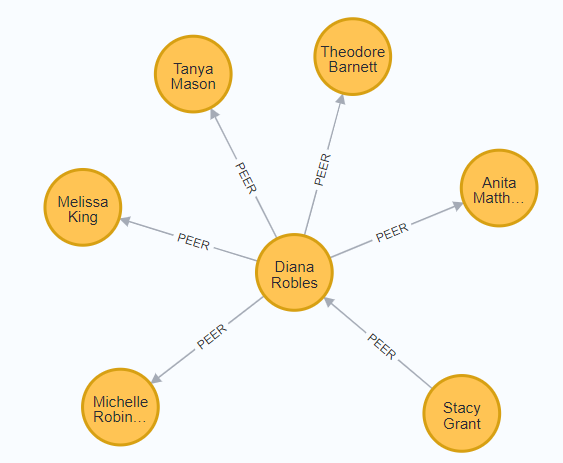
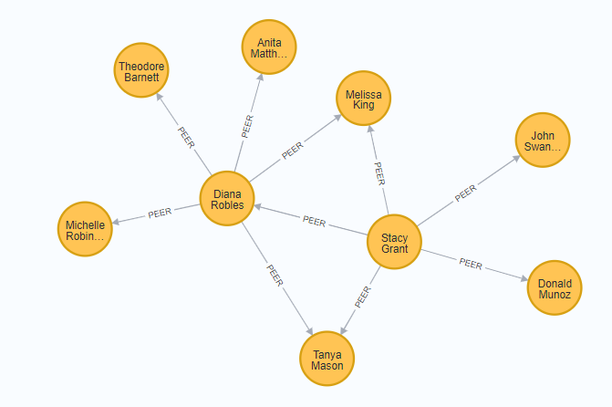
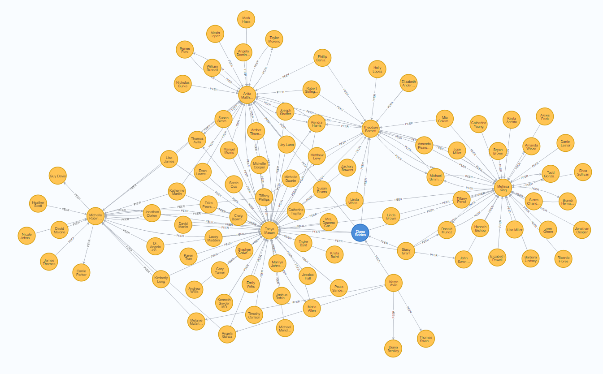

# Lab 6: Recommendation Engines III. Recommendations quality

# Introduction

Your goal of this Lab is the use of GDS algorithms for recommendations and subsequent 
estimation of its performance for the user of interest. 

This lab assumes your familiarity with the class material. 


_There are no precise instructions regarding content of the lab submission document. What you find below is just a guideline, not requirements. This lab is meant to be an experiment you conduct to explore movie recommendations options and uncover the best option available. Include information that you deem relevant to the task. Demonstrate your knowledge and ingenuity. The submission document should look like a preliminary lab report outlining your thinking and work-in-progress activities. Do not hesitate to provide more details and calculations that can help others understand what you do. For instance, in Part 2 you will  split the data into Train and Validation sets. Run a query making sure these subsets have expected counts of nodes. Explain your reasoning, include the query and its results into your submission._ 

# Setup

This lab is based on the Movies database created for Labs 4 and 5

# Part 1. Peer similarity 

The first part of the lab focuses on the GDS algorithms `FastRP` and `kNN`.  Execute the queries below. Feel free to use _.estimate_  if there are concerns related to the CPU/Memory resources.

## Step 1.1 Create GDS Projection

Create native GDS projection "Peers" for nodes *Movie*, *User* and relationships *RATED*. Make relationships undirected. 

```sql
CALL gds.graph.project("Peers", 
  ['Movie', 'User'], 
  { RATED:{orientation: "UNDIRECTED"}}
)
YIELD *
```
To make sure the projection is created properly, execute the following query returning the list of GDS projections. Include the resulting table to your submission. 

```sql 
call gds.graph.list 
      yield degreeDistribution, graphName, memoryUsage,
      sizeInBytes, nodeCount, relationshipCount, 
      density, schemaWithOrientation   
```  

## Step 1.2. Create embedding with FastRP algorithm

Use FastRP embedding algorithm to project "Peers" to a subspace of lower dimension. The graph has about 10,000 nodes. The rule of thumbs for selection of dimensionality _k_ is that _k_ << _ln(N)_ where _N_ is the number of data points and _ln()_ is natural logarithm. In our case, points are graph nodes. Given that _ln(10000)_ is about *10*, the dimension of embedding space can be chosen as _64_. (it's common to use powers of _2_ for _k_). 

* The result  of the algorithm should be  written to the projected nodes (mutated) as 64-long lists of floats (vectors) stored in an attrubute _embedding_.  
* The count of iterations is *4* (User->Movie->User-Movie) with
weights _[0,1,1,1]_
* Setting parameter *randomSeed* to a constant value guarantees replicability of the obtained results. 

```sql
CALL gds.fastRP.mutate (
     "Peers", 
    { embeddingDimension:64, 
      IterationWeights: [0.0,1.0,1.0,1.0,1.0], 
      randomSeed:7474, // for reproducibility 
      mutateProperty: "embedding" // property name
    }) YIELD *
```

## Step 1.3. Identify top  peers using kNN node similarity algorithm

The results of kNN algorithm will be written to the graph (not to the projection "Peer") in the form of new relationship "PEER" between "Users" with the property _score_ that indicate the strength of similarity between connected User nodes. This is a float number. I am going to use the Top 5 peers.
The low value of `topK` severely restricts the volume of peers considered eligible to give recommendations. With _250_ movies rated, her immediate neighborhood of peers who rated the same movies is _657_. The `topK` parameter could be safely increased to explore the recommendation algorithm performance for larger peers volume.


```sql
CALL gds.knn.write("Peers", 
     { nodeLabels:["User"],  
     nodeProperties:"embedding", topK:5,
     writeRelationshipType: "PEER",
     writeProperty: "score", 
     randomSeed: 42, 
     sampleRate: 0.9, 
     concurrency: 1
     })
YIELD *;
// Check
// match(u) -[r:PEER] - (o) return * limit 50
```

## Step 1.4. Recommendations

At this point, we are in the situation of collaborative filtering and can use 
the same approach as we have in Lab 5. 
Note that the "similarity" relation is symmetric. In other words, `:PEER` as a non-directional relationship. It makes sense to ignore the direction to identify peers. It will make 
each node attached to a higher number of peers (more than 5 in most cases) thereby considering a richer peer population to derive recommendations from. 

Here is an illustration of Diana'a peers. The relationships go from Diana to her 5 peers but there is also a `PEER` relationship from Stacy to Diana. It goes in the opposite direction. By ignoring directionality, Stacy will be considered Diana's sixth peer.

```sql
MATCH (diana:User where diana.name IN ["Diana Robles"]) 
      -[p:PEER] -(o) 
RETURN * 
```



Peers neighborhood of Diana and Stacy together can be retrieved by the query 
```sql
MATCH (diana:User where diana.name IN ["Diana Robles", "Stacy Grant"]) 
      -[p:PEER] -(o) return * 
```



<!--
A more complete query can be written using the count of hops modifier for `:PEER` relationship. Try to write it on your own. (Hint: `[:PEER*0..2]`). In my case, Diana's peers network is rather sparse. The degree of her node is _7_, and
there are peers in her neighborhood with degree up to 5 times higher.
(A good exercise is to reproduce queries to make the graph and table shown below)




<pre>
╒═════════════════╤══════╕
│peer             │degree│
╞═════════════════╪══════╡
│"Tanya Mason"    │52    │
├─────────────────┼──────┤
│"Michael Simmons"│45    │
├─────────────────┼──────┤
│"Thomas Avila"   │38    │
├─────────────────┼──────┤
│"Melissa King"   │34    │
├─────────────────┼──────┤
│"Anita Matthews" │29    │
└─────────────────┴──────┘
</pre>
--> 

Now we are ready to check recommendations which her peers offer. 
There are four options to consider.


**NOTE:** _A metric to rank recommendations plays a crucial role for the recommendation quality. In the code below the product `peerRating * votes` is just one possible choice used for demonstration. Other options are various blends of `peerRating` ,  `votes` and `imdbRating`. It is also possible to tweak the topK parameter of kNN algorithm to obtain a more comprehensive sample of peers, rank peers differently or use only the tops subset of peers ranked according to some criteria. The next part of this lab is concerned with development of a better metric to rank the "Top N" recommendations._ 


### Option 1.4.1. average peer ratings only

Take all movies rated by the peers and rank them by the product of peers' ratings and
count of votes. 

```sql
MATCH(diana:User{name:"Diana Robles"})
CALL { WITH diana 
      MATCH (diana)-[:PEER] - (peer:User) - [rate:RATED] ->(m:Movie)
      RETURN  m, rate, peer 
      ORDER BY  peer.score   DESC,  // peer similarity -- most similar peers first
                rate.rating  DESC   // peer rating     -- then their ratings
              }
WITH * 
WHERE NOT (diana)-[:RATED] -(m)
RETURN  m.title              AS title,  
   ROUND(AVG(rate.rating),2) AS peerRating, // average peer rating
   COUNT(DISTINCT peer) AS votes,           // votes
   m.imdbRating         AS imdbRating       // imdbRating as is
ORDER BY peerRating * votes DESC            // measure of film quality
LIMIT 10
```
The output: 

<pre>
╒════════════════════════════════════════════════╤══════════╤═════╤══════════╕
│title                                           │peerRating│votes│imdbRating│
╞════════════════════════════════════════════════╪══════════╪═════╪══════════╡
│"Bourne Identity, The"                          │3.92      │6    │7.9       │
├────────────────────────────────────────────────┼──────────┼─────┼──────────┤
│"Shawshank Redemption, The"                     │4.6       │5    │9.3       │
├────────────────────────────────────────────────┼──────────┼─────┼──────────┤
│"Silence of the Lambs, The"                     │4.6       │5    │8.6       │
├────────────────────────────────────────────────┼──────────┼─────┼──────────┤
│"Star Wars: Episode IV - A New Hope"            │3.83      │6    │8.7       │
├────────────────────────────────────────────────┼──────────┼─────┼──────────┤
│"City of God (Cidade de Deus)"                  │4.5       │5    │8.7       │
├────────────────────────────────────────────────┼──────────┼─────┼──────────┤
│"Toy Story"                                     │4.5       │5    │8.3       │
├────────────────────────────────────────────────┼──────────┼─────┼──────────┤
│"Star Wars: Episode V - The Empire Strikes Back"│4.5       │5    │8.8       │
├────────────────────────────────────────────────┼──────────┼─────┼──────────┤
│"Lord of the Rings: The Return of the King, The"│4.3       │5    │8.9       │
├────────────────────────────────────────────────┼──────────┼─────┼──────────┤
│"American Beauty"                               │4.2       │5    │8.4       │
├────────────────────────────────────────────────┼──────────┼─────┼──────────┤
│"Collateral"                                    │4.0       │5    │7.6       │
└────────────────────────────────────────────────┴──────────┴─────┴──────────┘
</pre>


### Option 1.4.2. peers ratings that are above Diana's global average

```sql
MATCH(diana:User{name:"Diana Robles"}) -[r:RATED] -()
WITH diana, AVG(r.rating) AS dianaAvgRating
CALL { WITH diana, dianaAvgRating
      MATCH (diana)-[:PEER] -(peer:User) - [rate:RATED] ->(m:Movie)
      WHERE rate.rating >  dianaAvgRating
      RETURN  m, rate, peer 
      ORDER BY  peer.score   DESC,  // peer similarity -- most similar peers first
                rate.rating  DESC   // peer rating     -- then their ratings
              }
WITH * 
WHERE NOT (diana)-[:RATED] -(m)
RETURN  m.title              AS title,  
   ROUND(AVG(rate.rating),2) AS peerRating, // average peer rating
   COUNT(DISTINCT peer) AS votes,           // votes
   m.imdbRating         AS imdbRating       // imdbRating as is
ORDER BY peerRating * votes DESC            // measure of film quality
LIMIT 10
```
The output is slightly different. However, all the usual suspects are there.

<pre>
╒════════════════════════════════════════════════╤══════════╤═════╤══════════╕
│title                                           │peerRating│votes│imdbRating│
╞════════════════════════════════════════════════╪══════════╪═════╪══════════╡
│"Silence of the Lambs, The"                     │4.6       │5    │8.6       │
├────────────────────────────────────────────────┼──────────┼─────┼──────────┤
│"Shawshank Redemption, The"                     │4.6       │5    │9.3       │
├────────────────────────────────────────────────┼──────────┼─────┼──────────┤
│"Toy Story"                                     │4.5       │5    │8.3       │
├────────────────────────────────────────────────┼──────────┼─────┼──────────┤
│"Star Wars: Episode V - The Empire Strikes Back"│4.5       │5    │8.8       │
├────────────────────────────────────────────────┼──────────┼─────┼──────────┤
│"Lord of the Rings: The Return of the King, The"│4.3       │5    │8.9       │
├────────────────────────────────────────────────┼──────────┼─────┼──────────┤
│"American Beauty"                               │4.2       │5    │8.4       │
├────────────────────────────────────────────────┼──────────┼─────┼──────────┤
│"Bourne Identity, The"                          │4.1       │5    │7.9       │
├────────────────────────────────────────────────┼──────────┼─────┼──────────┤
│"City of God (Cidade de Deus)"                  │4.88      │4    │8.7       │
├────────────────────────────────────────────────┼──────────┼─────┼──────────┤
│"There Will Be Blood"                           │4.5       │4    │8.1       │
├────────────────────────────────────────────────┼──────────┼─────┼──────────┤
│"Casino"                                        │4.38      │4    │8.2       │
└────────────────────────────────────────────────┴──────────┴─────┴──────────┘
</pre>

### Option 1.4.3. peers ratings that are above Diana's genre-level average

This is a twist on Option 4.2. Only votes that are higher than Diana's genre level average ratings are counted in. To make it more restrictive, I added the threshold "at least 25% higher" in another constraint for peer's movie selection

```sql
MATCH(diana:User{name:"Diana Robles"}) -[r:RATED] -(m) -[:IN_GENRE] ->(genre:Genre)
WITH diana, genre, AVG(r.rating) AS dianaAvgRating 
CALL { WITH diana, dianaAvgRating,genre
      MATCH (diana)-[:PEER] - (peer:User) - [rate:RATED] ->(m:Movie) -[:IN_GENRE] ->(g:Genre)
      WHERE 1.0*rate.rating/dianaAvgRating > 1.25 
        AND g = genre
      RETURN  m, rate, peer 
      ORDER BY  peer.score   DESC,  // peer similarity -- most similar peers first
                rate.rating  DESC   // peer rating     -- then their ratings
              }
WITH * 
WHERE NOT (diana)-[:RATED] -(m)
RETURN  m.title              AS title,  
   ROUND(AVG(rate.rating),2) AS peerRating, // average peer rating
   COUNT(DISTINCT peer) AS votes,           // votes
   m.imdbRating         AS imdbRating       // imdbRating as is
ORDER BY peerRating * votes DESC            // measure of film quality
LIMIT 10
```

The output again is a bit different and the count of votes is somehow reduced.

<pre>
╒════════════════════════════════════════════════╤══════════╤═════╤══════════╕
│title                                           │peerRating│votes│imdbRating│
╞════════════════════════════════════════════════╪══════════╪═════╪══════════╡
│"Silence of the Lambs, The"                     │4.77      │5    │8.6       │
├────────────────────────────────────────────────┼──────────┼─────┼──────────┤
│"Toy Story"                                     │4.5       │5    │8.3       │
├────────────────────────────────────────────────┼──────────┼─────┼──────────┤
│"American Beauty"                               │4.33      │5    │8.4       │
├────────────────────────────────────────────────┼──────────┼─────┼──────────┤
│"City of God (Cidade de Deus)"                  │4.88      │4    │8.7       │
├────────────────────────────────────────────────┼──────────┼─────┼──────────┤
│"Star Wars: Episode V - The Empire Strikes Back"│4.82      │4    │8.8       │
├────────────────────────────────────────────────┼──────────┼─────┼──────────┤
│"Lord of the Rings: The Return of the King, The"│4.53      │4    │8.9       │
├────────────────────────────────────────────────┼──────────┼─────┼──────────┤
│"Kiss Kiss Bang Bang"                           │4.4       │4    │7.6       │
├────────────────────────────────────────────────┼──────────┼─────┼──────────┤
│"Star Wars: Episode IV - A New Hope"            │4.33      │4    │8.7       │
├────────────────────────────────────────────────┼──────────┼─────┼──────────┤
│"Bourne Identity, The"                          │4.25      │4    │7.9       │
├────────────────────────────────────────────────┼──────────┼─────┼──────────┤
│"Terminator 2: Judgment Day"                    │4.2       │4    │8.5       │
└────────────────────────────────────────────────┴──────────┴─────┴──────────┘
</pre>


### Option 1.4.4. Diana's preferred genres

Finally, restrict recommendations even more by only choosing movies from genres with Diana's average rating higher than her global average rating. To make it more interesting, I added the list of genres that contributed to the selection of these movies for recommendations. This data is informative and also can be used for weighing recommendations - a higher number of genres the movie has, the more likely Diana will watch it (hm... probably... may be not). 


```sql
MATCH (diana:User{name:"Diana Robles"})
CALL { WITH diana 
      MATCH (diana) -[a:RATED] -(gm)
      RETURN AVG(a.rating) AS dianaGlobalRating 
     }
MATCH(diana) -[r:RATED] -(m) -[:IN_GENRE] ->(genre:Genre)
WITH diana, genre, dianaGlobalRating, AVG(r.rating) AS dianaAvgRating 
WHERE dianaAvgRating > dianaGlobalRating
CALL { WITH diana, dianaAvgRating, genre
      MATCH (diana)-[:PEER] ->(peer:User) - [rate:RATED] ->(m:Movie) 
                   -[:IN_GENRE] ->(g:Genre)
      WHERE 1.0*rate.rating/dianaAvgRating > 1.25 
        AND g = genre
      RETURN  m, rate, peer, genre as peerGenre
      ORDER BY  peer.score   DESC,  // peer similarity -- most similar peers first
                rate.rating  DESC   // peer rating     -- then their ratings
     }
WITH * 
WHERE NOT (diana)-[:RATED] -(m)
RETURN  m.title              AS title,  
   ROUND(AVG(rate.rating),2) AS peerRating, // average peer rating
   COUNT(DISTINCT peer) AS votes,           // votes
   m.imdbRating         AS imdbRating,      // imdbRating as is
   collect(DISTINCT peerGenre.name) as genres // list of genres matching criteria
ORDER BY peerRating * votes DESC            // measure of film quality
LIMIT 10
```

Again, the output is slightly different. The last column with the list of genres may look  a bit surprising with "Toy Story" being an Adventure. However, "Toy Story" is listed under 
"Children", "Animation", "Comedy", "Adventure", and "Fantasy." It's because Diana's average rating for "Adventure" (_3.1857_) is higher than her global average rating (_3.1511_), Toy Story appears in this recommendation list. 

<pre>
╒════════════════════════════════════════════════╤══════════╤═════╤══════════╤═════════════════════════════════════════╕
│title                                           │peerRating│votes│imdbRating│genres                                   │
╞════════════════════════════════════════════════╪══════════╪═════╪══════════╪═════════════════════════════════════════╡
│"Toy Story"                                     │4.38      │4    │8.3       │["Adventure"]                            │
├────────────────────────────────────────────────┼──────────┼─────┼──────────┼─────────────────────────────────────────┤
│"Bourne Identity, The"                          │4.25      │4    │7.9       │["Action", "Mystery"]                    │
├────────────────────────────────────────────────┼──────────┼─────┼──────────┼─────────────────────────────────────────┤
│"Terminator 2: Judgment Day"                    │4.2       │4    │8.5       │["Action", "Sci-Fi"]                     │
├────────────────────────────────────────────────┼──────────┼─────┼──────────┼─────────────────────────────────────────┤
│"Shawshank Redemption, The"                     │5.0       │3    │9.3       │["Crime", "Drama"]                       │
├────────────────────────────────────────────────┼──────────┼─────┼──────────┼─────────────────────────────────────────┤
│"There Will Be Blood"                           │4.9       │3    │8.1       │["Drama", "Western"]                     │
├────────────────────────────────────────────────┼──────────┼─────┼──────────┼─────────────────────────────────────────┤
│"Silence of the Lambs, The"                     │4.83      │3    │8.6       │["Crime"]                                │
├────────────────────────────────────────────────┼──────────┼─────┼──────────┼─────────────────────────────────────────┤
│"Collateral"                                    │4.83      │3    │7.6       │["Crime", "Drama", "Action"]             │
├────────────────────────────────────────────────┼──────────┼─────┼──────────┼─────────────────────────────────────────┤
│"City of God (Cidade de Deus)"                  │4.83      │3    │8.7       │["Crime", "Drama", "Adventure", "Action"]│
├────────────────────────────────────────────────┼──────────┼─────┼──────────┼─────────────────────────────────────────┤
│"Star Wars: Episode V - The Empire Strikes Back"│4.75      │3    │8.8       │["Adventure", "Action", "Sci-Fi"]        │
├────────────────────────────────────────────────┼──────────┼─────┼──────────┼─────────────────────────────────────────┤
│"Kung Fu Panda"                                 │4.67      │3    │7.6       │["Action", "IMAX"]                       │
└────────────────────────────────────────────────┴──────────┴─────┴──────────┴─────────────────────────────────────────┘
</pre>


# Part 2. Validation

Validation of recommendations relevance will use the random split or Diana's movies and create the "Validation" set. The terms "training" and "validation" sets are commonly used in predictive analytics and machine learning. Our situation a bit different but the same terminology will be used.  

We can think of Validation set as a movies that "Diana has not watched yet."
These movies cannot be used to identify her peers, but they will be included in the  recommendations. Then the recommendation quality be measured by Jaccard similarity between the set of recommended movies and movies from the Validation set. 

## Step 2.1. Validation set

We will allocate 20% of Diana's movies for Validation. 

It is possible to carve a Cypher query and use Cypher projection to build a GDS graph but it appears easier to just add labels to Movie nodes and create a Native projection instead.


```sql
// Step 1: Split Diana’s movies into two sets. 
//     Add an attribute "dataset" first that will be 
//     used to add labels to Movie nodes
MATCH(u:User) -[r:RATED] -> (m:Movie)
WHERE u.name = "Diana Robles"
SET m.dataset =  CASE WHEN rand() < 0.8 THEN "Train"
                      ELSE "Validation" END
RETURN m.title, m.dataset ;

// Step 2: Add Validation label (to use by Native GDS projection)
MATCH(u:User) -[r:RATED] -(m:Movie)
WHERE u.name = "Diana Robles" AND m.dataset = "Validation" 
SET m:Validation;   

// Step 3: All other movies go into Train set (to use by GDS projection)
MATCH(u:User) -[r:RATED] -(m:Movie)
WHERE  m.dataset is NULL OR m.dataset <> "Validation"
SET m:Train;   

```
## Step 2.2. Identify peers ignoring Diana's Validation set 


First, create GDS projection that does not included Validation movies

```sql
// Step 1: Create Projection for Peers identification
CALL gds.graph.project("PeersTrain", 
  ["Train", 'User'], 
  {RATED:{orientation: "UNDIRECTED"}}
) YIELD *;
```

Apply _fastRP_ and save the results in the PeersTrain projection

```sql
CALL gds.fastRP.mutate (
     'PeersTrain', 
    { embeddingDimension:64, 
      IterationWeights: [0.0,1.0,1.0,1.0], 
      randomSeed:7474,     
      mutateProperty: 'embedding'
    }) YIELD *
```
Identify top 5 peers by kNN algorithm and write the *PEER_TRAIN* relationship with the _score_ attribute  back to the graph.

```sql
CALL gds.knn.write("PeersTrain", 
     { nodeLabels:["User"],  
     nodeProperties:"embedding", topK:50,
     writeRelationshipType: "PEER_TRAIN",
     writeProperty: "score", 
     randomSeed: 42,     
     concurrency: 1
     })
YIELD *;
```

## Step 2.3. Recommendations Quality 

The recommendations quality will be measured by Jaccard index between the Validation set and the Top 10, 20, 30, 40, and 50 recommendations ordered by recommendation "score." Add more options if needed. The longer the recommendation list, the more movies will be found in the Validation set. If you took any of the Data Mining or Data Science classes, think about the balance between Precision and Recall. 


### Option 1. average peer ratings only

```sql
MATCH(diana:User{name:"Diana Robles"})
CALL { WITH diana 
      MATCH (diana)-[:PEER_TRAIN] // Peers defined by the TRAIN set only
          - (peer:User) - [rate:RATED] ->(m:Movie)
      RETURN  m, rate, peer 
      ORDER BY  peer.score   DESC,  // peer similarity -- most similar peers first
                rate.rating  DESC   // peer rating     -- then their ratings
              }
WITH m, // movies recommended by peers
   ROUND(AVG(rate.rating),2) AS peerRating, // average peer rating
   COUNT(DISTINCT peer) AS votes,           // votes
   m.imdbRating         AS imdbRating       // imdbRating as is
ORDER BY peerRating * votes DESC            // measure of film quality (score)
WITH COLLECT(ID(m)) as recommendation       // collect all recommendations ordered by score
CALL {match(mt:Validation) return collect(ID(mt)) as validation } // validation set
RETURN size(recommendation) AS sizeof_rec ,
       size(validation)     AS sizeof_val, 
    ROUND(gds.similarity.jaccard(recommendation[0..9], validation),4) 
      AS quality_10,
    ROUND(gds.similarity.jaccard(recommendation[0..19], validation),4) 
      AS quality_20, 
    ROUND(gds.similarity.jaccard(recommendation[0..29], validation),4) 
      AS quality_30,
    ROUND(gds.similarity.jaccard(recommendation[0..39], validation),4) 
      AS quality_40,
    ROUND(gds.similarity.jaccard(recommendation[0..49], validation),4) 
      AS quality_50
```
<pre>
╒══════════╤══════════╤══════════╤══════════╤══════════╤══════════╤══════════╕
│sizeof_rec│sizeof_val│quality_10│quality_20│quality_30│quality_40│quality_50│
╞══════════╪══════════╪══════════╪══════════╪══════════╪══════════╪══════════╡
│518       │54        │0.0161    │0.0429    │0.0375    │0.0449    │0.051     │
└──────────┴──────────┴──────────┴──────────┴──────────┴──────────┴──────────┘
</pre>


### Option 2. peers ratings that are above Diana's global average

```sql
MATCH(diana:User{name:"Diana Robles"}) -[r:RATED] -()
WITH diana, AVG(r.rating) AS dianaAvgRating
CALL { WITH diana, dianaAvgRating
      MATCH (diana)-[:PEER_TRAIN]  // Peers defined by the TRAIN set only
        -(peer:User) - [rate:RATED] ->(m:Movie)
      WHERE rate.rating >  dianaAvgRating
      RETURN  m, rate, peer 
      ORDER BY  peer.score   DESC,  // peer similarity -- most similar peers first
                rate.rating  DESC   // peer rating     -- then their ratings
              }
WITH m,                                     // movies recommended by peers 
   ROUND(AVG(rate.rating),2) AS peerRating, // average peer rating
   COUNT(DISTINCT peer) AS votes,           // votes
   m.imdbRating         AS imdbRating       // imdbRating as is
ORDER BY peerRating * votes DESC            // measure of film quality
WITH COLLECT(ID(m)) as recommendation       // collect all recommendations ordered by score
CALL {match(mt:Validation) return collect(ID(mt)) as validation } // validation set
RETURN size(recommendation) AS sizeof_rec ,
       size(validation)     AS sizeof_val, 
    ROUND(gds.similarity.jaccard(recommendation[0..9], validation),4) 
      AS quality_10,
    ROUND(gds.similarity.jaccard(recommendation[0..19], validation),4) 
      AS quality_20, 
    ROUND(gds.similarity.jaccard(recommendation[0..29], validation),4) 
      AS quality_30,
    ROUND(gds.similarity.jaccard(recommendation[0..39], validation),4) 
      AS quality_40,
    ROUND(gds.similarity.jaccard(recommendation[0..49], validation),4) 
      AS quality_50
```

<pre>
╒══════════╤══════════╤══════════╤══════════╤══════════╤══════════╤══════════╕
│sizeof_rec│sizeof_val│quality_10│quality_20│quality_30│quality_40│quality_50│
╞══════════╪══════════╪══════════╪══════════╪══════════╪══════════╪══════════╡
│379       │54        │0.0161    │0.0429    │0.0375    │0.0449    │0.051     │
└──────────┴──────────┴──────────┴──────────┴──────────┴──────────┴──────────┘
</pre>

### Option 3. peers ratings that are above Diana's genre-level average

```sql
MATCH(diana:User{name:"Diana Robles"}) -[r:RATED] -(m) -[:IN_GENRE] ->(genre:Genre)
WITH diana, genre, AVG(r.rating) AS dianaAvgRating 
CALL { WITH diana, dianaAvgRating,genre
      MATCH (diana)-[:PEER_TRAIN]  // Peers defined by the TRAIN set only
        - (peer:User) - [rate:RATED] ->(m:Movie) -[:IN_GENRE] ->(g:Genre)
      WHERE 1.0*rate.rating/dianaAvgRating > 1.25 
        AND g = genre
      RETURN  m, rate, peer 
      ORDER BY  peer.score   DESC,  // peer similarity -- most similar peers first
                rate.rating  DESC   // peer rating     -- then their ratings
              }
WITH m,                                     // movies recommended by peers 
   ROUND(AVG(rate.rating),2) AS peerRating, // average peer rating
   COUNT(DISTINCT peer) AS votes,           // votes
   m.imdbRating         AS imdbRating       // imdbRating as is
ORDER BY peerRating * votes DESC            // measure of film quality
WITH COLLECT(ID(m)) as recommendation       // collect all recommendations ordered by score
CALL {match(mt:Validation) return collect(ID(mt)) as validation } // validation set
RETURN size(recommendation) AS sizeof_rec ,
       size(validation)     AS sizeof_val, 
    ROUND(gds.similarity.jaccard(recommendation[0..9], validation),4) 
      AS quality_10,
    ROUND(gds.similarity.jaccard(recommendation[0..19], validation),4) 
      AS quality_20, 
    ROUND(gds.similarity.jaccard(recommendation[0..29], validation),4) 
      AS quality_30,
    ROUND(gds.similarity.jaccard(recommendation[0..39], validation),4) 
      AS quality_40,
    ROUND(gds.similarity.jaccard(recommendation[0..49], validation),4) 
      AS quality_50
```
<pre>
╒══════════╤══════════╤══════════╤══════════╤══════════╤══════════╤══════════╕
│sizeof_rec│sizeof_val│quality_10│quality_20│quality_30│quality_40│quality_50│
╞══════════╪══════════╪══════════╪══════════╪══════════╪══════════╪══════════╡
│274       │54        │0.0161    │0.0282    │0.0247    │0.0333    │0.0404    │
└──────────┴──────────┴──────────┴──────────┴──────────┴──────────┴──────────┘
</pre>


### Option 4. Diana's preferred genres

```sql
MATCH (diana:User{name:"Diana Robles"})
CALL { WITH diana 
      MATCH (diana) -[a:RATED] -(gm)
      RETURN AVG(a.rating) AS dianaGlobalRating 
     }
MATCH(diana) -[r:RATED] -(m) -[:IN_GENRE] ->(genre:Genre)
WITH diana, genre, dianaGlobalRating, AVG(r.rating) AS dianaAvgRating 
WHERE dianaAvgRating > dianaGlobalRating
CALL { WITH diana, dianaAvgRating, genre
      MATCH (diana)-[:PEER_TRAIN]  // Peers defined by the TRAIN set only
            -(peer:User) - [rate:RATED] ->(m:Movie) 
                   -[:IN_GENRE] ->(g:Genre)
      WHERE 1.0*rate.rating/dianaAvgRating > 1.25 
        AND g = genre
      RETURN  m, rate, peer, genre as peerGenre
      ORDER BY  peer.score   DESC,  // peer similarity -- most similar peers first
                rate.rating  DESC   // peer rating     -- then their ratings
     }
WITH m,                                     // movies recommended by peers 
   ROUND(AVG(rate.rating),2) AS peerRating, // average peer rating
   COUNT(DISTINCT peer) AS votes,           // votes
   m.imdbRating         AS imdbRating,      // imdbRating as is
   collect(DISTINCT peerGenre.name) as genres // list of genres matching criteria
ORDER BY peerRating * votes DESC            // measure of film quality
WITH COLLECT(ID(m)) as recommendation       // collect all recommendations ordered by score
CALL {match(mt:Validation) return collect(ID(mt)) as validation } // validation set
RETURN size(recommendation) AS sizeof_rec ,
       size(validation)     AS sizeof_val, 
    ROUND(gds.similarity.jaccard(recommendation[0..9], validation),4) 
      AS quality_10,
    ROUND(gds.similarity.jaccard(recommendation[0..19], validation),4) 
      AS quality_20, 
    ROUND(gds.similarity.jaccard(recommendation[0..29], validation),4) 
      AS quality_30,
    ROUND(gds.similarity.jaccard(recommendation[0..39], validation),4) 
      AS quality_40,
    ROUND(gds.similarity.jaccard(recommendation[0..49], validation),4) 
      AS quality_50
```

<pre>
╒══════════╤══════════╤══════════╤══════════╤══════════╤══════════╤══════════╕
│sizeof_rec│sizeof_val│quality_10│quality_20│quality_30│quality_40│quality_50│
╞══════════╪══════════╪══════════╪══════════╪══════════╪══════════╪══════════╡
│219       │54        │0.0161    │0.0282    │0.0375    │0.0449    │0.0404    │
└──────────┴──────────┴──────────┴──────────┴──────────┴──────────┴──────────┘
</pre>


### All results together: 


<pre>
Option 1. average peer ratings only
╒══════════╤══════════╤══════════╤══════════╤══════════╤══════════╤══════════╕
│sizeof_rec│sizeof_val│quality_10│quality_20│quality_30│quality_40│quality_50│
╞══════════╪══════════╪══════════╪══════════╪══════════╪══════════╪══════════╡
│518       │54        │0.0161    │0.0429    │0.0375    │0.0449    │0.051     │
└──────────┴──────────┴──────────┴──────────┴──────────┴──────────┴──────────┘

Option 2. peers ratings that are above Diana's global average
╒══════════╤══════════╤══════════╤══════════╤══════════╤══════════╤══════════╕
│sizeof_rec│sizeof_val│quality_10│quality_20│quality_30│quality_40│quality_50│
╞══════════╪══════════╪══════════╪══════════╪══════════╪══════════╪══════════╡
│379       │54        │0.0161    │0.0429    │0.0375    │0.0449    │0.051     │
└──────────┴──────────┴──────────┴──────────┴──────────┴──────────┴──────────┘

Option 3. peers ratings that are above Diana's genre-level average
╒══════════╤══════════╤══════════╤══════════╤══════════╤══════════╤══════════╕
│sizeof_rec│sizeof_val│quality_10│quality_20│quality_30│quality_40│quality_50│
╞══════════╪══════════╪══════════╪══════════╪══════════╪══════════╪══════════╡
│274       │54        │0.0161    │0.0282    │0.0247    │0.0333    │0.0404    │
└──────────┴──────────┴──────────┴──────────┴──────────┴──────────┴──────────┘

Option 4. Diana's preferred genres
╒══════════╤══════════╤══════════╤══════════╤══════════╤══════════╤══════════╕
│sizeof_rec│sizeof_val│quality_10│quality_20│quality_30│quality_40│quality_50│
╞══════════╪══════════╪══════════╪══════════╪══════════╪══════════╪══════════╡
│219       │54        │0.0161    │0.0282    │0.0375    │0.0449    │0.0404    │
└──────────┴──────────┴──────────┴──────────┴──────────┴──────────┴──────────┘
</pre>


The quality is measured by the highest Jaccard index reached by the lowest count of Top recommendations. Based on this definition, Options 1 and 2 are  winners reaching 0.0429 for Top 20 recommended movies. This result can be improved by making selection of recommended movies more conservative. Below is the table for the Option 2 query with `WHERE rate.rating >  dianaAvgRating` replaced by `WHERE rate.rating >  1.3*dianaAvgRating` (the average rating of recommended movie must be at least 30% higher than Diana's overall rating average)
<pre>
╒══════════╤══════════╤══════════╤══════════╤══════════╤══════════╤══════════╕
│sizeof_rec│sizeof_val│quality_10│quality_20│quality_30│quality_40│quality_50│
╞══════════╪══════════╪══════════╪══════════╪══════════╪══════════╪══════════╡
│167       │54        │0.0328    │0.0282    │0.0506    │0.0814    │0.0729    │
└──────────┴──────────┴──────────┴──────────┴──────────┴──────────┴──────────┘
</pre>

The top 40 movies reach the Jaccard index of _0.0814_ for this setup.

It appears that inclusion of genres into recommendation decisions has a negative effect on the quality. This could be attributed to a rather vague classification of movies by genre. 

Note however, that these conclusions need to be verified. Algorithms we use are probabilistic, and if we ran them again, the results will be different. It's too unreliable to make decisions based only on a limited set of experiments. The findings must be thoroughly validated before production deployment. Also, Jaccard index in such a small range (0.08 max) is rather disappointing. Other recommendation methods should be explored.  

Finally, there are many parameters to tweak. In the real life scenario, parameter optimization tasks are automated using various techniques. Most popular are random search, simple grid search, and Bayesian (hyper)parameter optimization.


## Assignments 

Include all your queries and intermediary results to the submission document. 

### Part 1

Apply the approach outlined above to build the list of recommendations for the Person you are working with. 

1. Use _FastRP_ and _kNN_ algorithms to create the list of peers. 
2. Generate set of recommendations by the four methods described in the Part 1 of this lab.  
3. Include table with top 10 recommendations for each method
    

### Part 2

Evaluate quality of generated recommendations

3. Create Train and Validation sets, write a query that compute the count of nodes in each set. Add the result to your submission. 
5. Evaluate each of the four methods using techniques presented in this lab.
3. Experiment and come up with a better metric to rank recommendations.
4. Apply at least two algorithms you developed in Lab 4 and Lab 5 (content based and collaborative filtering) to the Train set and evaluate performance of these algorithms on the Validation set. Check the list of peers; it will be different than the peers used in Assignment Part 1.


### Part 3
5. Present evaluation results of algorithms performance in a table similar to the one shown above and create a summary of your findings. Which methods yield better recommendation results? What is the best metric to rank recommendations? 
6. Add your further reflections and thoughts to the lab submission. 

## Submission

Collect all your results - queries, code, thoughts, conjectures, etc. - into a document, <u>**convert it to a PDF file**</u> and submit before the deadline. 


See [Lab 4 (Content based)](https://github.com/vryzhov/COSC416-2024/tree/main/lab4)    

See [Lab 5 (Collaborative Filtering)](https://github.com/vryzhov/COSC416-2024/tree/main/lab5)   


